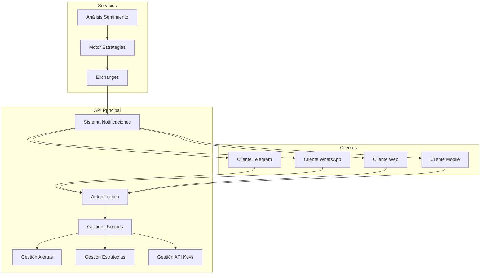
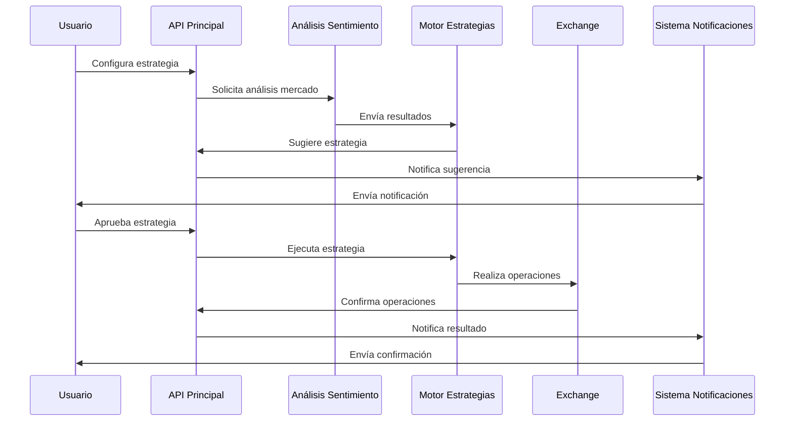
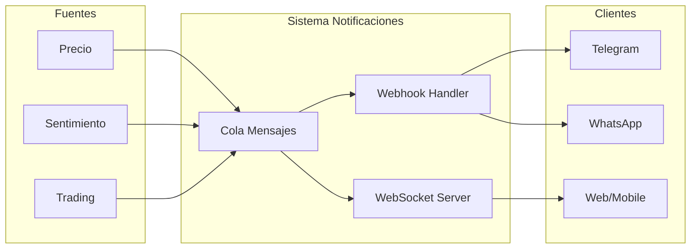

# Crypto Trading Bot - Plan de Desarrollo

## Estructura del Proyecto

```
crypto-trading/
├── api/                    # API principal (actual)
├── clients/               # Clientes para diferentes plataformas
│   ├── telegram/
│   ├── whatsapp/
│   ├── web-client/
│   └── mobile-app/
└── services/             # Servicios adicionales
    ├── market-sentiment/ # Análisis de sentimiento del mercado
    └── strategy-engine/  # Motor de estrategias

```

## Diagramas de Flujo

### Flujo General del Sistema


### Flujo de Análisis y Ejecución de Estrategias


### Flujo de Notificaciones


## Tareas Pendientes

### 1. API Principal (Actual)

- [x] Autenticación y registro de usuarios
- [x] CRUD de pares de activos
- [x] CRUD de alertas de precios
- [x] Roles de usuario (admin/normal)
- [ ] Endpoints para gestión de API keys de exchanges
  - [ ] CRUD de API keys
  - [ ] Encriptación segura de claves
  - [ ] Validación de permisos por exchange
- [ ] Endpoints para gestión de estrategias
  - [ ] CRUD de estrategias personalizadas
  - [ ] Configuración de parámetros
  - [ ] Activación/desactivación de estrategias
- [ ] Sistema de notificaciones
  - [ ] Cola de mensajes (RabbitMQ/Redis)
  - [ ] Webhooks para clientes
  - [ ] Historial de notificaciones

### 2. Clientes (Nuevos Proyectos)

#### 2.1 Cliente Telegram
- [ ] Bot de Telegram
- [ ] Comandos básicos (/start, /help, etc.)
- [ ] Autenticación mediante la API
- [ ] Gestión de alertas
- [ ] Recepción de notificaciones

#### 2.2 Cliente WhatsApp
- [ ] Integración con WhatsApp Business API
- [ ] Autenticación mediante la API
- [ ] Gestión de alertas
- [ ] Recepción de notificaciones

#### 2.3 Cliente Web
- [ ] Panel de control
- [ ] Gráficos y estadísticas
- [ ] Gestión de cuenta
- [ ] Configuración de estrategias
- [ ] Centro de notificaciones

#### 2.4 Cliente Mobile
- [ ] App nativa (Flutter/React Native)
- [ ] Autenticación
- [ ] Gestión de alertas y estrategias
- [ ] Notificaciones push

### 3. Servicios Adicionales

#### 3.1 Análisis de Sentimiento del Mercado
- [ ] Recolección de datos
  - [ ] Redes sociales
  - [ ] Noticias
  - [ ] Foros de trading
- [ ] Procesamiento y análisis
  - [ ] NLP para análisis de sentimiento
  - [ ] Indicadores de mercado
  - [ ] Métricas on-chain
- [ ] API de resultados
  - [ ] Endpoints para consulta
  - [ ] Webhooks para actualizaciones

#### 3.2 Motor de Estrategias
- [ ] Implementación de estrategias base
  - [ ] Bull market
  - [ ] Bear market
  - [ ] Mercado neutral
- [ ] Sistema de evaluación
  - [ ] Backtesting
  - [ ] Paper trading
  - [ ] Métricas de rendimiento
- [ ] Integración con exchanges
  - [ ] Binance
  - [ ] Coinbase
  - [ ] Otros exchanges populares

## Notas de Implementación

### Sistema de Notificaciones
- Usar WebSockets para notificaciones en tiempo real en web/mobile
- Implementar sistema de colas para garantizar entrega de mensajes
- Permitir personalización de notificaciones por usuario

### Seguridad
- Implementar 2FA
- Auditoría de acciones de usuario
- Rate limiting
- Monitoreo de actividad sospechosa

### Escalabilidad
- Diseñar servicios como microservicios independientes
- Usar contenedores Docker para fácil despliegue
- Implementar balanceo de carga
- Cacheo de datos frecuentes

### Base de Datos
- Separar datos por servicio
- Implementar sharding para escalabilidad
- Backups automáticos
- Replicación para alta disponibilidad

## Prioridades de Desarrollo

1. Completar funcionalidad core de la API
2. Implementar sistema de notificaciones
3. Desarrollar cliente Telegram (por ser el más sencillo)
4. Implementar motor de estrategias básico
5. Desarrollar cliente web
6. Implementar análisis de sentimiento
7. Desarrollar clientes restantes
